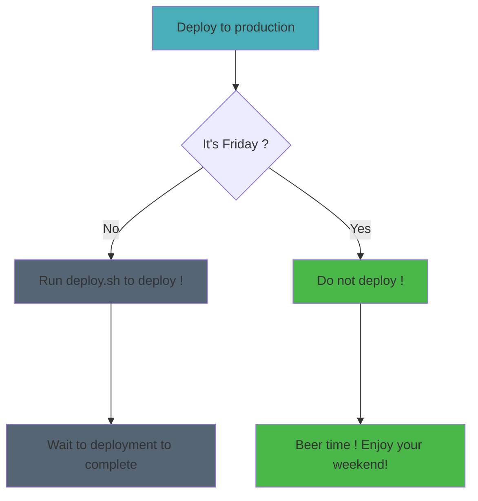

```mermaid
flowchart TD
    A[Deploy to production]:::rootclass -->  B{It's Friday ?}
    B -- No --> D[Run deploy.sh to deploy !]:::sadclass
    D ----> F[Wait to deployment to complete]:::sadclass
    B -- Yes --> C[Do not deploy !]:::niceclass
    C ----> E[Beer time ! Enjoy your weekend!]:::niceclass
    
    classDef rootclass fill:#49ADB7
    classDef sadclass fill:#566573
    classDef niceclass fill:#4AB749
```